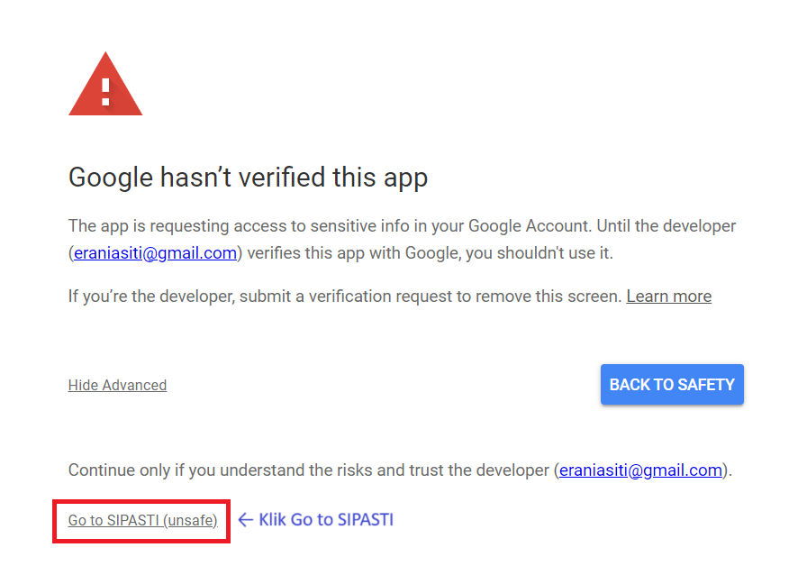

# SIPASTI GUI

---

SIPASTI adalah sistem yang digunakan untuk memudahkan pelacakan proses surat di FK UIN Jakarta. 
Sistem GUI (*graphical user interface*) ini digunakan untuk menampilkan data surat yang sedang diproses oleh FK UIN Jakarta.

Aplikasi ini membutuhkan izin untuk membaca file untuk dimuat di Google Sheets. 
Aplikasi ini hanya akan mengakses data surat yang akan ditampilkan di SIPASTI, dan tidak memiliki akses terhadap data pribadi anda.

## Cara penggunan:

1. [Klik tautan ini](https://drive.usercontent.google.com/download?id=1eVID8kpjmld4SBmxg4vcytNTH03ie6_i&export=download) untuk mengunduh aplikasi, lalu tekan tombol `Download anyway`.
   
2. Buka file yang sudah diunduh. Setelahnya akan muncul dialog untuk setup aplikasi.
   Pastikan untuk menceklis bagian Create a desktop shortcut, lalu pilih Next.
   
3. Lalu pilih Install
   
4. Klik Finish untuk membuka aplikasi.
   
5. Jika ada pop-up Java yang muncul, pilih Allow.
   
6. Setelah aplikasi terbuka, klik login.
   
7. Tombol tersebut akan membuka browser dan menampilkan akun Google anda.
   Silahkan login ke akun yang memiliki akses ke Sheets SIPASTI.
   
8. Google akan memberikan peringatan akses aplikasi yang belum terverifikasi.
   Klik Advanced, lalu klik GO to SIPASTI.
   
   
9. Klik Continue.
   
10. Setelahnya anda dapat kembali ke aplikasi SIPASTI.
    Aplikasi akan menunjukkan tabel data surat yang diproses.
    
    